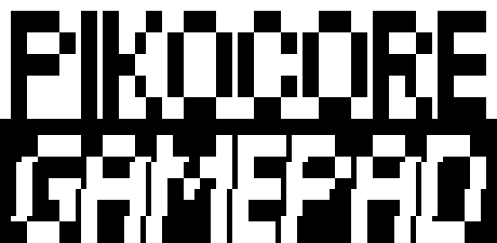

<p align="center">
  
</p>

# pikocore — RP2350-PiZero + GamePi13 port

A community port of [pikocore](https://github.com/schollz/pikocore), the hackable
open-source lo-fi sampler, to run on the **Waveshare RP2350-PiZero** paired with the
**GamePi13** handheld HAT — trading the original's bare-bones potentiometer interface
for a 240×240 color LCD dashboard and a 12-button game-console layout.

This is an independent fork, not officially affiliated with the original pikocore
project or with Waveshare.

## What's different from stock pikocore

- **Full-color 240×240 LCD dashboard** — BPM, clock source, sample name/index,
  live waveform with playhead and per-slice highlighting, the active parameter's
  value as a segmented bar, and the current mode.
- **12 physical buttons** (D-pad + Y/X/B/A + Select/Start/L/R) replace the original's
  8 buttons + 3 potentiometers, with a full on-screen menu system to reach every
  parameter without needing analog knobs.
- **Save/Load device state to flash** — one persisted slot covering every parameter,
  the sequencer pattern, and each mode's own knob position, with on-screen
  save/load confirmation icons.
- **Onboard step sequencer** with visible record/play/clear feedback instead of a
  blind knob.
- **USB bank-loader web app** (React + Vite, in `web/`) to build `.pikobank` files
  from your own samples and load them straight over USB.
- microSD `.pikobank` browsing exists in the codebase but ships **disabled by
  default** behind a build flag (`PIKO_GAMEPI13_SD`) — see
  [GAMEPI13-INTERFACE.md](GAMEPI13-INTERFACE.md) for why.

All of the original pikocore's audio engine — sample playback, slicing, retrigger/
stutter, probability-driven jump/gate/reverse/tunnel effects, filter, timestretch —
is untouched; this port only adds the screen, the button-driven menu, and the
persistence layer around it.

## Hardware

- [Waveshare RP2350-PiZero](https://www.waveshare.com/wiki/RP2350-PiZero) —
  RP2350B, dual Cortex-M33/Hazard3, 520KB SRAM, 16MB flash, Pi Zero form factor.
- [Waveshare GamePi13](https://www.waveshare.com/wiki/GamePi13) — 1.3" 240×240
  ST7789 LCD, 12-button handheld HAT, onboard speaker/headphone jack.
- microSD card (optional, FAT32) — only needed if you rebuild with
  `PIKO_GAMEPI13_SD=ON`.

## Building

```
mkdir -p build-gamepi && cd build-gamepi
cmake -DPICO_SDK_PATH=../pico-sdk -DPIKO_GAMEPI13=ON ..
make -j4
```

Flash `build-gamepi/pikocore.uf2` (hold BOOTSEL while plugging in USB).

The original, unmodified stock-hardware build (potentiometers, no LCD) still works
from the same tree — see the [upstream build instructions](#upstream-pikocore) below.

## Loading samples

```
cd web && npm install && npm run dev
```

Build a bank from your own samples and either load it straight over USB, or use
the "Download bank" button to produce a `.pikobank` file for a microSD card (if
built with SD support).

## Controls

| Control | Function |
|---|---|
| D-pad + Y/X/B/A | pikocore's 8 music buttons |
| Select | cycle parameter mode (tap), or hold + a music button to jump directly to that mode |
| L / R | decrease/increase the active parameter (Function A); hold to repeat |
| Start (tap) | mute / start-stop |
| Start (hold) + L/R | edit Function B instead of Function A |
| Up+Down+B+A | reset FX (filter, distortion, all probabilities) |
| Down+Left+X+B | toggle clock lock |

Full mode table, per-button behavior, retrigger mechanics, and every hardware
finding from bring-up are in [GAMEPI13-INTERFACE.md](GAMEPI13-INTERFACE.md)
(Spanish). Build/flash/pinout quick reference:
[README-GAMEPI13.md](README-GAMEPI13.md) (Spanish).

## Upstream pikocore

For the original potentiometer-based hardware, schematic, BOM, and firmware
releases, see the upstream project:

- [Website](https://pikocore.com)
- [Source code](https://github.com/schollz/pikocore)
- [Schematic](https://infinitedigits.co/img/pikocore_schematic.png)
- [BOM](https://infinitedigits.co/wares/pikocore/#bom)
- [Video demonstration](https://www.youtube.com/watch?v=mKPq1Chm9Tg)

```
SAMPLE_RATE=31000 make
```

(`make build2` if you're on a 2MB Pico; the default targets 16MB.) See the
upstream README for the full prerequisites list (`make prereqs`).

## Acknowledgments

This port stands entirely on other people's work:

- **[Zack Scholl](https://github.com/schollz)** ([infinitedigits.co](https://infinitedigits.co)) —
  created [pikocore](https://github.com/schollz/pikocore), the sampler engine this
  whole project is built on. pikocore is the deliberately minimal, cheap sibling of
  his larger [zeptocore](https://github.com/schollz/_core) sampler; both descend
  from the same `_core` lineage.
- **[Waveshare](https://www.waveshare.com/)** — designed the
  [RP2350-PiZero](https://www.waveshare.com/wiki/RP2350-PiZero) board and the
  [GamePi13](https://www.waveshare.com/wiki/GamePi13) HAT this port targets. The
  vendored LCD driver (`src/gamepi13/lcd/`) and board files
  (`RP2350-PiZero/`, `Gamepi13-RP2040-Demo/`) are adapted from Waveshare's own demo
  code for this hardware.
- **[Raspberry Pi Foundation](https://github.com/raspberrypi/pico-sdk)** — the
  Pico SDK this firmware (and the RP2350) builds on.
- **[carlk3](https://github.com/carlk3/no-OS-FatFS-SD-SDIO-SPI-RPi-Pico)** — the
  microSD FatFS driver used for the (currently parked) SD bank-browsing mode,
  itself built on **ChaN's [FatFs](http://elm-chan.org/fsw/ff/00index_e.html)**, an
  SPI block-device driver derived from Mbed OS 5's `SDBlockDevice`, and an SDIO
  driver derived from [ZuluSCSI-firmware](https://github.com/ZuluSCSI/ZuluSCSI-firmware).
- **Raspberry Pi (Trading) Ltd** and **ForsakenNGS** — the WS2812 driver
  (`doth/WS2812.cpp`), inherited from upstream pikocore under its original
  BSD-3-Clause / GPL-3 dual attribution (see the file header).
- **andrewikenberry** and **[Jacob Vosmaer](https://github.com/jvosmaer)** — the
  one-wire MIDI implementation (`doth/onewiremidi.h`), MIT licensed, inherited from
  upstream pikocore.
- **[ittybittymidi](https://ittybittymidi.com)** — the MIDI clock-in hardware
  pikocore's `MIDI_IN_ENABLED` build option targets.
- **[Lopaka](https://lopaka.app)** — the pixel-art tool used to design every LCD
  UI bitmap in this port (digits, mode labels, icons, splash screen).

## License

MIT — see [LICENSE](LICENSE). Some vendored third-party components carry their
own licenses; see the file headers under `doth/` and the Acknowledgments section
above.
